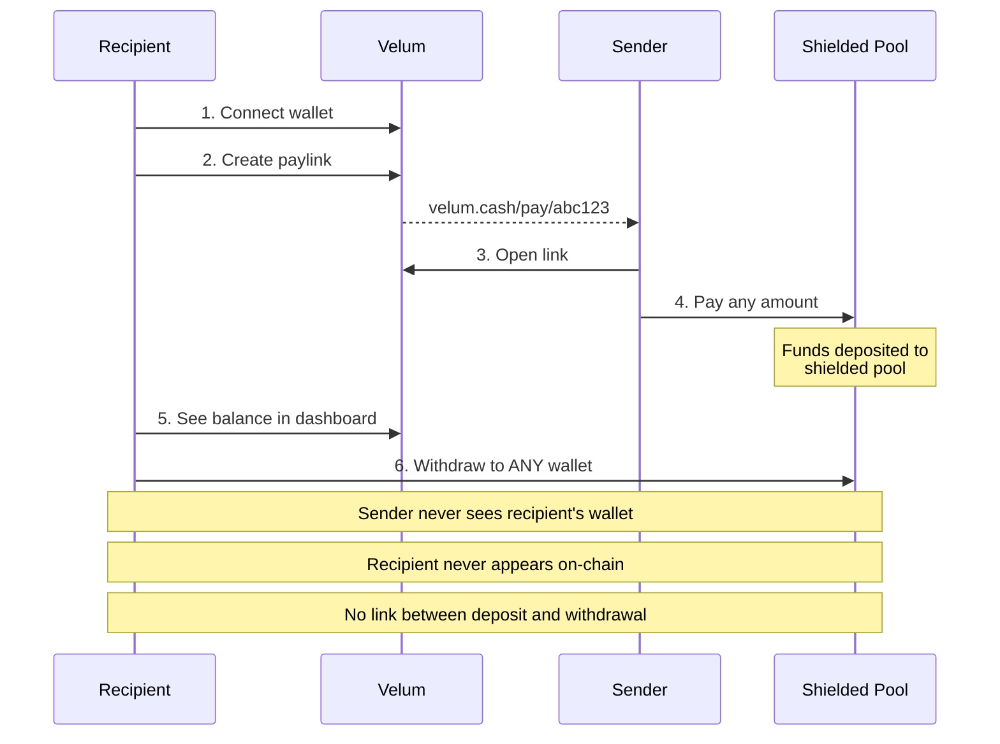
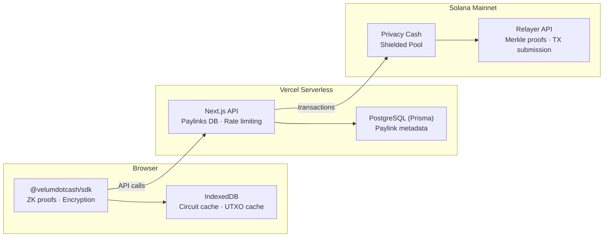

<p align="center">
  
</p>

<h3 align="center">Private Payments on Solana</h3>

<p align="center">
  Shareable payment links with complete privacy. Powered by Zero-Knowledge proofs.
</p>

<p align="center">
  <a href="https://velum.cash"></a>
  <a href="https://x.com/velumdotcash"></a>
  <a href="https://www.npmjs.com/package/@velumdotcash/sdk"></a>
  <a href="https://www.npmjs.com/package/@velumdotcash/api"></a>
  <a href="#license"></a>
  
</p>

---

## 🔍 The Problem

On public blockchains, **every transaction is visible**. If someone knows your wallet address, they can see:

- Your entire balance
- Who pays you and how much
- Who you pay and how much
- Your complete financial history

This creates real problems:

| Scenario | What Happens On-Chain |
|----------|----------------------|
| **Freelancer** | Your client sees all your other clients, your rates, your total income |
| **Content Creator** | Fans can stalk your wallet — see your balance, other supporters, how you spend |
| **E-commerce** | Competitors see your sales volume; every customer transaction linked to your business |
| **Donations** | Donors exposed publicly; recipients know exactly how much donors have |
| **Payroll** | Your employer can track how you spend your salary |
| **Friends & Family** | "I see you have 50 SOL, why can't you pay me back?" |

---

## 🛡️ The Solution

Velum enables **private payment links** on Solana. Create a link, share it, receive funds — without ever revealing your wallet address.



### Privacy Guarantees

| Property | Guaranteed | How |
|----------|:----------:|-----|
| Sender cannot see recipient's wallet | ✅ | Paylink contains only derived cryptographic keys |
| Recipient never appears on-chain | ✅ | Withdrawals via relayer; only derived keys used |
| Deposit → Withdrawal link broken | ✅ | ZK proof verifies without revealing connection |

### Supported Tokens

- **SOL** — Native Solana
- **USDC** — Circle USD
- **USDT** — Tether USD

---

## ⚙️ How It Works

Velum combines three cryptographic primitives to achieve privacy:

### 1. Shielded Pool (UTXO Model)

Funds are stored as encrypted commitments in a Merkle tree. Each UTXO (Unspent Transaction Output) contains:

```
commitment = Poseidon(amount, pubkey, blinding, mint)
```

The commitment hides all values while allowing ZK verification.

### 2. Zero-Knowledge Proofs

When withdrawing, a ZK proof verifies:
- You own a valid UTXO in the pool (without revealing which one)
- The amounts balance correctly
- No double-spending

The proof reveals **nothing** about which UTXO is being spent or who owns it.

### 3. Asymmetric Encryption (V3)

For paylinks, the sender encrypts UTXO data using the recipient's X25519 public key:

```
encrypted_note = NaCl.box(utxo_data, recipient_pubkey, ephemeral_keypair)
```

Only the recipient can decrypt. Each encryption uses a fresh ephemeral keypair for forward secrecy.

### Architecture Diagram



---

## 🔧 SDK Fork: Privacy Cash Modifications

Velum is built on a **forked version** of the [Privacy Cash SDK](https://github.com/Privacy-Cash/privacy-cash-sdk). The original SDK only supports self-deposits. We extended it to enable **third-party deposits** — the core of the paylink system.

### Key Modifications

| # | Modification | Problem Solved |
|---|-------------|----------------|
| 1 | **Wallet-Adapter Constructor** | Original requires private key; now works with Phantom/Solflare |
| 2 | **Asymmetric Encryption (V3)** | Only self-deposits → third-party deposits with recipient encryption |
| 3 | **Pubkey-Only UTXO Mode** | Can't create UTXO for others → sender creates UTXO owned by recipient |
| 4 | **Third-Party Deposits** | `deposit()` always for self → optional `recipientUtxoPublicKey` param |
| 5 | **Key Export Methods** | No way to get shielded keys → `getAsymmetricPublicKey()`, `getShieldedPublicKey()` |
| 6 | **Early Termination** | Scan 50k UTXOs = 30s → O(1) hash check = 0.5s |
| 7 | **Browser Compatibility** | Node.js APIs → Web Crypto, fetch(), IndexedDB |

### Example: Third-Party Deposit

```typescript
// Original SDK: only self-deposit
await sdk.deposit({ lamports: 1_000_000_000 });

// Our fork: deposit to a recipient
await sdk.deposit({
  lamports: 1_000_000_000,
  recipientUtxoPublicKey: paylink.recipientUtxoPubkey,      // BN254 pubkey
  recipientEncryptionKey: paylink.recipientEncryptionKey,   // X25519 pubkey
});
```

For detailed documentation, see [SDK Modifications](https://velum.cash/docs/sdk-modifications).

---

## 📦 Project Structure

This is a **Turborepo** monorepo with the following structure:

```
privacy-paylink/
├── apps/
│   └── web/                    # Next.js 15 application
│       ├── app/                # App Router pages & API routes
│       │   ├── api/            # REST API (paylinks, transactions)
│       │   ├── pay/[id]/       # Payment page
│       │   ├── receive/        # Create paylink page
│       │   ├── withdraw/       # Withdrawal page
│       │   └── dashboard/      # Paylink history
│       ├── components/         # React components
│       ├── lib/
│       │   ├── hooks/          # useVelum, useDeposit, useWithdraw
│       │   └── config/         # Token configuration
│       ├── content/docs/       # MDX documentation
│       └── prisma/             # Database schema
│
├── packages/
│   ├── sdk/                    # @velumdotcash/sdk - ZK operations
│   │   ├── src/
│   │   │   ├── index.ts        # Velum class
│   │   │   ├── deposit.ts      # Deposit logic (modified for 3rd party)
│   │   │   ├── withdraw.ts     # Withdrawal logic
│   │   │   ├── getUtxos.ts     # UTXO scanning with early termination
│   │   │   └── utils/
│   │   │       └── encryption.ts  # V1/V2/V3 encryption schemes
│   │   └── dist/               # Compiled output
│   │
│   └── api/                    # @velumdotcash/api - REST client
│       └── src/
│           └── index.ts        # VelumClient class
│
└── docs/                       # Internal documentation
    └── tech.md                 # Technical deep-dive
```

### Tech Stack

| Layer | Technology |
|-------|------------|
| **Frontend** | Next.js 15, React 19, Tailwind CSS, Framer Motion |
| **Backend** | Next.js API Routes (Vercel Serverless) |
| **Database** | PostgreSQL (Prisma ORM) |
| **ZK Proofs** | snarkjs, Groth16, Poseidon hash |
| **Encryption** | NaCl (tweetnacl), Web Crypto API |
| **Blockchain** | Solana, SPL Token |
| **Rate Limiting** | Upstash Redis |
| **Build** | Turborepo, TypeScript |

---

## 🚀 Quick Start

### Prerequisites

- Node.js 18+
- PostgreSQL database
- Solana RPC endpoint (mainnet)

### Installation

```bash
# Clone the repository
git clone https://github.com/velumdotcash/velum.git
cd velum

# Install dependencies
npm install

# Set up environment variables
cp apps/web/.env.example apps/web/.env
# Edit .env with your values

# Initialize database
npm run db:push --workspace=apps/web

# Start development server
npm run dev
```

### Environment Variables

```bash
# Database
DATABASE_URL="postgresql://..."

# Solana
NEXT_PUBLIC_SOLANA_RPC_URL="https://api.mainnet-beta.solana.com"
NEXT_PUBLIC_SOLANA_NETWORK="mainnet-beta"

# Token Mints (mainnet)
NEXT_PUBLIC_SOL_MINT="So11111111111111111111111111111111111111112"
NEXT_PUBLIC_USDC_MINT="EPjFWdd5AufqSSqeM2qN1xzybapC8G4wEGGkZwyTDt1v"
NEXT_PUBLIC_USDT_MINT="Es9vMFrzaCERmJfrF4H2FYD4KCoNkY11McCe8BenwNYB"

# App
NEXT_PUBLIC_APP_URL="https://your-domain.com"

# Rate Limiting (Upstash)
UPSTASH_REDIS_REST_URL="..."
UPSTASH_REDIS_REST_TOKEN="..."
```

---

## 🧑‍💻 Developer Integration

Build private payments into your application using our npm packages.

### @velumdotcash/api — REST Client

Server-side client for creating and managing paylinks.

```bash
npm install @velumdotcash/api
```

```typescript
import { VelumClient } from "@velumdotcash/api";

const client = new VelumClient({ apiKey: process.env.VELUM_API_KEY });

// Create a payment link
const paylink = await client.paylinks.create({
  recipientUtxoPubkey: "21888242871839...",
  recipientEncryptionKey: "base64encodedkey...",
  token: "USDC",
  amountLamports: "1000000", // 1 USDC
});

console.log(paylink.url); // https://velum.cash/pay/clx1234...
```

### @velumdotcash/sdk — ZK SDK

Client-side SDK for deposits, withdrawals, and proof generation.

```bash
npm install @velumdotcash/sdk
```

```typescript
import { Velum } from "@velumdotcash/sdk";

// Initialize with wallet signature
const sdk = new Velum({
  RPC_url: "https://api.mainnet-beta.solana.com",
  publicKey: wallet.publicKey,
  signature: await wallet.signMessage("Privacy Money account sign in"),
  transactionSigner: async (tx) => wallet.signTransaction(tx),
});

// Get shielded keys (for paylink creation)
const encryptionKey = sdk.getAsymmetricPublicKey();
const utxoPubkey = await sdk.getShieldedPublicKey();

// Check private balance
const { lamports } = await sdk.getPrivateBalance();

// Withdraw to any address
await sdk.withdraw({
  lamports: 1_000_000_000,
  recipientAddress: "FreshWa11etAddress...",
});
```

### Full Documentation

- [API Reference](https://velum.cash/docs/api) — REST endpoints
- [Developer Guide](https://velum.cash/docs/developer-guide) — Integration walkthrough
- [SDK Modifications](https://velum.cash/docs/sdk-modifications) — Fork details

---

## ☁️ Deployment

### Vercel (Recommended)

[](https://vercel.com/new/clone?repository-url=https://github.com/velumdotcash/privacy-paylink)

1. Click "Deploy with Vercel"
2. Add environment variables in Vercel dashboard
3. Deploy

### Manual

```bash
npm run build
npm run start
```

---

## 🏗️ Building on Velum

Want to build private payment experiences? The `@velumdotcash/sdk` and `@velumdotcash/api` packages are designed for developers to integrate into their own applications.

**Use cases:**
- E-commerce checkout with privacy
- Creator monetization platforms
- Private donation systems
- Payroll and invoicing tools

Check out the [Developer Guide](https://velum.cash/docs/developer-guide) to get started.

---

## 🤝 Acknowledgments

Velum is built on top of [Privacy Cash](https://privacycash.org) — an audited ZK privacy protocol on Solana. We extend our gratitude to the Privacy Cash team for their foundational work on the shielded pool infrastructure and ZK verification contracts.

---

## 📄 License

MIT License — see [LICENSE](LICENSE) for details.

---

<p align="center">
  <a href="https://velum.cash">Website</a> •
  <a href="https://velum.cash/docs">Documentation</a> •
  <a href="https://x.com/velumdotcash">Twitter</a>
</p>
